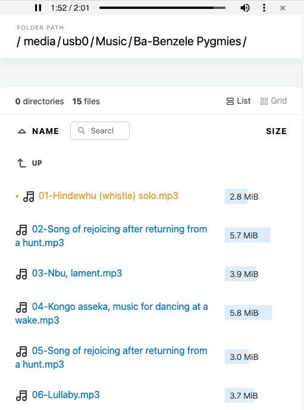
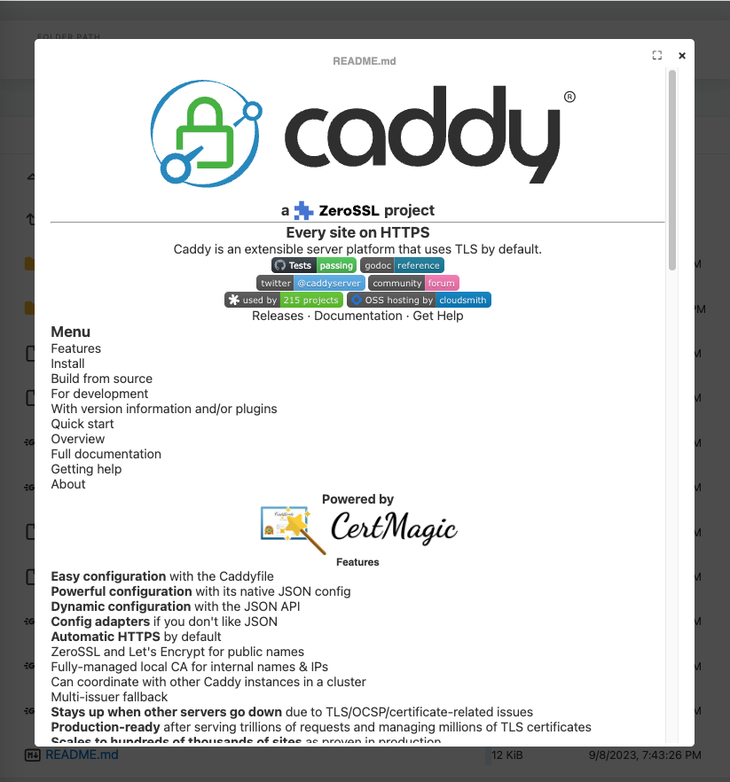
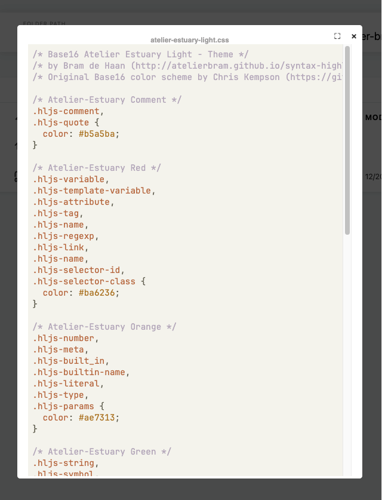

# caddy `file_server` customized `browse.html` template with media extensions

Customized template for caddy [**`file_server`**](https://caddyserver.com/docs/caddyfile/directives/file_server). Compared to caddy's default [browse.html](https://github.com/caddyserver/caddy/blob/master/modules/caddyhttp/fileserver/browse.html) this template offers the following extra features:

- play all audios inline (with automatic sequential autoplay)
- dynamic preview mode for images, video, HTML and source code files without page reload
- image gallery mode with easy navigation using :arrow_left: & :arrow_right: keys
- play videos with VTT and SRT subtitles support
- markdown preview using [marked](https://github.com/markedjs/marked)
- code highlighting for common source file formats using [highlight](https://github.com/highlightjs/highlight.js)

## Usage

In your **`Caddyfile`** set the [**`browse`**](https://caddyserver.com/docs/caddyfile/directives/file_server#syntax) subdirective under **`file_server`** to point to the custom **`browse.html`** ([view source](https://github.com/glowinthedark/caddy-file-server-browse-extension/blob/master/browse.html)) file:

```Caddyfile
http:// {
    file_server {
        root /path/to/my/server/root
        browse /path/to/folder/caddy/templates/browse.html
    }
}
```
## HEIC Preview Support
Preview for HEIC images works natively in Safari browsers on iOS and macOS. No other browsers can render HEIC natively.

An experimental branch with slower Javascript-based HEIC decoding for non-Apple browsers is available in this repo in the [**`heic`**](https://github.com/glowinthedark/caddy-file-server-browse-extension/tree/heic) branch.

If you feel like experimenting:

```sh
# clone master branch and switch
git clone https://github.com/glowinthedark/caddy-file-server-browse-extension.git
git checkout heic

# OR clone the heic branch directly
git clone --branch heic https://github.com/glowinthedark/caddy-file-server-browse-extension.git
```

Move the files from `./sidecar` folder to caddy's `SERVE_ROOT/.assets` as described in the [**`README.md`**](https://github.com/glowinthedark/caddy-file-server-browse-extension/blob/heic/README.md). In the simplest scenario the `SERVE_ROOT` would be the value of the **`root`** subdirective under the **`file_server`** directive in your `Caddyfile`, although this will not necessarily be the case in a more complex setup.


## Screenshots

##### inline audio player 


##### markdown renderer


##### source file highlighter

